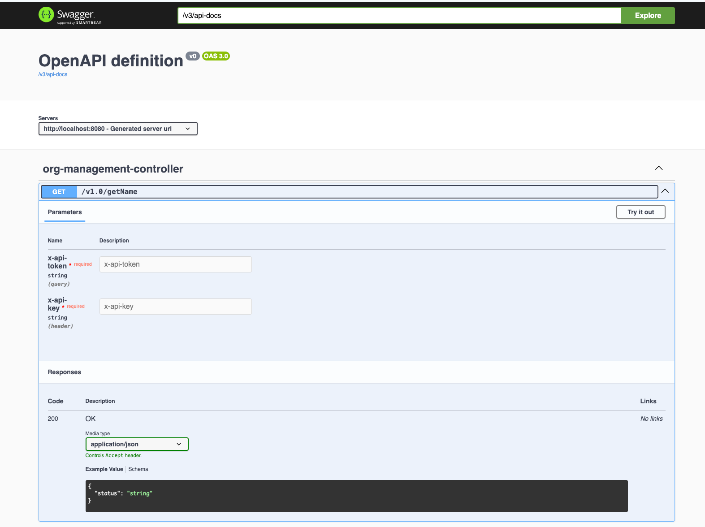

[**Sample Spring Boot 3 Application**](https://github.com/ghulsure/springboot-app-template)

**Introduction**

This is a sample Spring Boot 3 application designed to demonstrate the basic setup and functionality of a Spring Boot project. The application includes a simple REST API that can be used to perform basic GET operations.

**Prerequisites**

Before you begin, ensure you have met the following requirements:

Java Development Kit (JDK) 17 or later Link to download https://developer.ibm.com/languages/java/semeru-runtimes/downloads/

Maven 3.6.3 or later Link - https://maven.apache.org/download.cgi

An IDE such as IntelliJ IDEA, Eclipse, or VS Code Link https://www.jetbrains.com/idea/download/?section=mac

**Getting Started**

Clone the Repository

Clone this repository to your local machine using the following command:

    git clone [https://github.com/your-username/sample-springboot3-app.git](https://github.com/ghulsure/springboot-app-skeleton.git)

Build the Application

Navigate to the project directory and build the application using Maven commands:

Navigate: 

    cd sample-springboot3-app

To package:

    mvn clean install (or) mvn clean package

Running the Application: 

    mvn spring-boot:run 

You can run the application using the following command:

    java -jar target/sample-springboot3-app-0.0.1-SNAPSHOT.jar

Alternatively, you can run the application directly from your IDE by running the SampleSpringBoot3Application class.

Accessing the Application

Once the application is running, you can access the REST API at http://localhost:8080/v1.0/getName.

API Endpoints

The following endpoints are available in this sample application:

    GET /v1.0/getName - returns sample string message
    Required param: x-api-token: "test"
    required header param: x-api-key: "test"

Access swagger yaml at http://localhost:8080/v3/api-docs

Test API using swagger UI at http://localhost:8080/swagger-ui/index.html

Click on Try it out and then fill out required fields lastly click on execute to see results

**Configuration**
The application can be configured using the application.properties file located in the src/main/resources directory. Here you can set various properties such as the server port, database connection details, etc.

**Git Commands**

Pulling Changes

To pull the latest changes from the remote repository, use the following command:

    git pull origin dev

Adding Files

To add files to the staging area, use the following command:

    git add <file-name>

To add all changes, use:

    git add .

Committing Files

To commit the staged changes, use the following command:

    git commit -m "Your commit message"

Pushing Changes

To push your committed changes to the remote repository, use the following command:

    git push origin <local branch>

Merging Changes

To merge changes from another branch into your current branch, use the following command:

    git merge <branch-name>

Resolving Conflicts

If there are conflicts during a merge, Git will mark the conflicted areas in the files. Open the conflicted files and resolve the conflicts manually. After resolving the conflicts, add the resolved files to the staging area:

    git add <resolved-file>

Then commit the changes:

    git commit -m "Resolved merge conflicts"

Finally, push the resolved changes:

    git push origin main

Creating and Checking Out a New Branch

To create a new branch from the dev branch and check it out, use the following commands:

    git checkout dev   
    git pull origin dev
    git checkout -b <new-branch-name>
